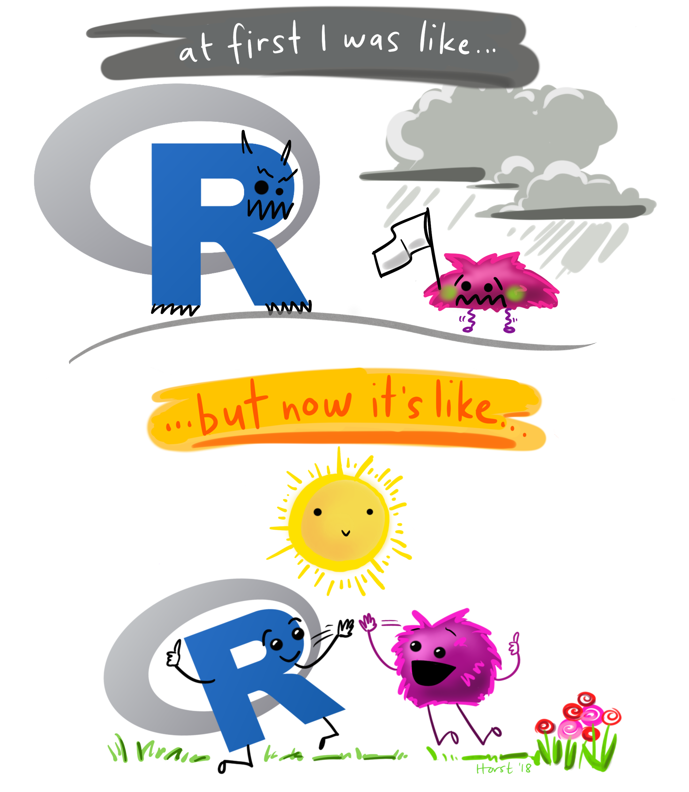
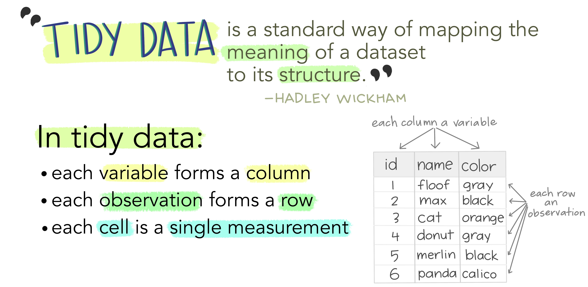
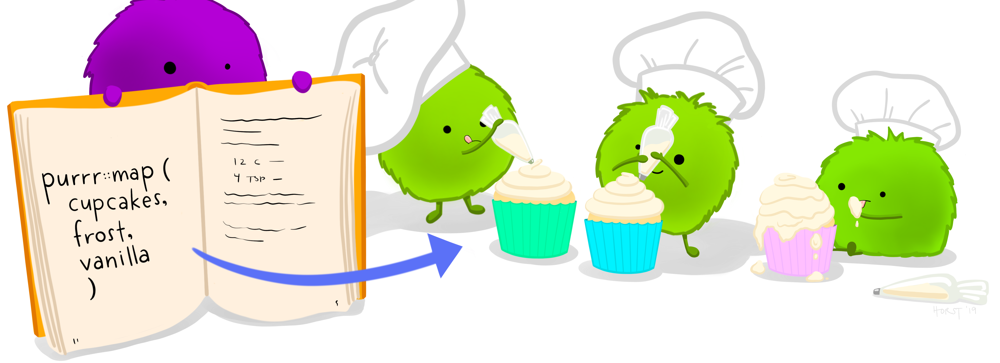
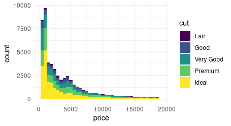
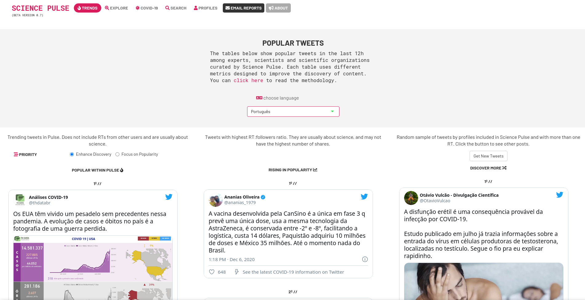
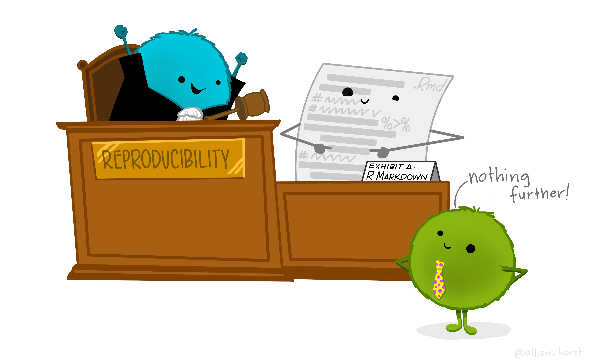
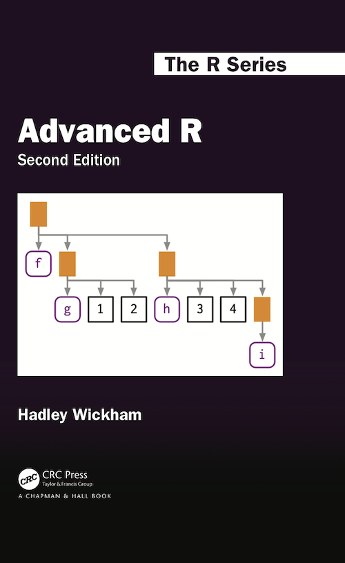

```{r, include=FALSE, warning=FALSE, message=FALSE}
library(reticulate)
options(htmltools.dir.version = FALSE)
knitr::knit_engines$set(python = eng_python)
knitr::opts_chunk$set(comment = "#>", echo = TRUE, fig.align = "center")
```

# Credenciais

.pull-left[

```{r, echo=FALSE, dpi=180}

```

]

.pull-right[

- [Caio Lente](https://lente.dev/)

- Bacharel em Ciência da Computação pelo IME-USP

- Mestando em Ciência da Computação no IME-USP

- Sócio e cientista de dados na Terranova Consultoria

- Sócio e professor na Curso-R Treinamentos

]


---
# História do R

.pull-left[

- 1993: a primeira aparição do R

- 2000: sai a v1.0, a primeira versão pronta para produção

- 2006: ocorre a primeira useR!, a conferência anual de programadores R

- 2011: é lançado o RStudio, a IDE mais popular para R

- Atualmente (12/2020), ela já é a
[9ª linguagem](https://www.tiobe.com/tiobe-index/) mais popular do mundo

]

.pull-right[

```{r, echo=FALSE, dpi=550}

```

]

---
# R Básico

.pull-left[

- R é uma linguagem para programação estatística

  - A classe **data frame** é embutida na linguagem
  
  - Para facilitar a realização de experimentos, ela usa scripting

- Preocupação central em compatibilidade reversa
  
- Por trás dos panos, praticamente roda C

]

.pull-right[

```{r}
df <- data.frame(x = runif(5))

df

sd(df$x)
```

]

---
# R Básico

.pull-left[

```{r}
vec <- c(1, 3, 4, 7, 9)
lst <- list(1, "b", TRUE)
```


```{r}
vec[vec < 5]
vec * 2
lst[[2]]
```

]

.pull-right[

```{r}
factor(c("G", "G", "M", "P", "P"))
lm(mpg ~ wt, mtcars)
```

]

---
# R Moderno

.pull-left[

- O advento do `tidyverse` mudou o R para sempre

  - Programação paralela

  - Programação funcional

  - **Tibbles** vs. data frames

  - NSE: non-standard evaluation

- Novas funcionalidades sem prejudicar código já implementado

- Origem: [Tidy Data Manifesto](https://vita.had.co.nz/papers/tidy-data.pdf)

]

.pull-right[

```{r, message=FALSE}
library(tidyverse)

tb <- tibble(x = runif(5))
tb <- mutate(tb, y = x * 2)
tb <- arrange(tb, y)

tb
```

]

---
# Tidyverse

```{r, echo=FALSE, dpi=480}

```

---
# Tidyverse

.pull-left[

- `dplyr` é como o `pandas` do R, mas muito mais poderoso

```{r, echo=FALSE, dpi=400}
knitr::include_graphics("static/dplyr_wrangling.png")
```

]

.pull-right[

- Pipeline: a saída de uma linha vira entrada da próxima

```{r, message=FALSE}
mtcars %>%
  filter(gear < 5) %>%
  group_by(cyl) %>%
  summarise(mpg = mean(mpg)) %>%
  mutate(kpl = mpg * 0.425) %>%
  select(cyl, kpl)
```

]

---
# R Funcional


.pull-left[

- Uma das maiores adições ao R foi o pacote `purrr`

- Programação funcional e lambdas

]

.pull-right[

```{r}
map_dbl(c(1,10), ~runif(1, max=.x))
```


]

```{r, echo=FALSE, dpi=600}

```

---
# Pacotes e o CRAN

.pull-left[

- Os pacotes do R são como as bibliotecas de outras linguages

- O jeito mais fácil de instalar um pacote é do CRAN

  - O CRAN é um órgão que garante a qualidade dos pacotes
  
  - O processo de aceite é **rigoroso**
  
  - Há testes para 12 arquiteturas
  
  - A qualidade dos pacotes do R é excepcionalmente alta

]

.pull-right[

```{r, echo=FALSE, dpi=150}
knitr::include_graphics("static/rpkgs.png")
```

]

---
# R para Visualização

.pull-left[

```{r, eval=FALSE}
library(ggplot2)

diamonds %>%
  ggplot(aes(price, fill = cut)) +
  geom_histogram(binwidth = 500)
```

```{r, echo=FALSE}

```

]

.pull-right[

- Na gramática dos gráficos, definimos um gráfico em camadas

  - A **estética** define os eixos
  
  - A **geometria** define as formas
  
  - Podemos empilhas estéticas e geometrias
  
- O `ggplot2` permite criar gráficos a partir de tabelas

- Em poucas linhas, temos um gráfico preciso e elegante

]

---
# R para Dashboards

.pull-left[

- `shiny` é o "killer app" do R

- Esse pacote permite criar dashboards interativos em R

  - Saber um pouco de HTML/CSS ajuda, mas é desnecessário
  
  - Código R existente pode ser facilmente portado
  
  - O [shinyapps.io](https://www.shinyapps.io/) hospeda de graça
  
- Alguns sites nem parecem dashboards normais

]

.pull-right[

```{r, echo=FALSE, dpi=150}
knitr::include_graphics("static/shiny.png")
```

]

---
# R para Dashboards

```{r, echo=FALSE, dpi=200}

```

---
# R vs. Python

.pull-left[

```r
# NSE não precisa de aspas
mutate(df, Area = L*H)

# Mutate para N variáveis
mutate(df, A = L*H, V = A*10)


# Chaining com pipes
df %>%
  gather() %>%
  rename("k"="key","v"="value") %>%
  filter(v > 1)


# Operação comum
bind_cols(df1, df2)
```

]

.pull-right[

```python
# Repetição do nome da base
df['Area'] = df.L*df.H

# Lambda prolixo
df.assign(A=lambda df: df.L*df.H,
          V=lambda df: df.A*10)

# Chaining com ponto
df = (pd.melt(df)
        .rename(columns={
                'variable' : 'k',
                'value' : 'v'})
        .query('v > 1')
     )

# Reutilização de operador
pd.concat([df1,df2], axis=1)
```

]

---
# R vs. Python

- Não existe discussão sobre a "linguagem melhor", apenas sobre qual linguagem
é melhor para quê

- Python claramente é uma linguagem mais completa e amplamente utilizada, mas
o R também é uma linguagem moderna e extremamente capaz

- O fato de o R ter sido feito para trabalhar com dados facilita certas operações

  - Modelagem estatística é trivial e embutida no R
  
  - Leitura e manipulação de dados são parte do núcleo da linguagem
  
  - Pacotes estáveis e retrocompatíveis acabam com a necessidade de `pyenv`,
  `virtualenv` ou `anaconda`
  
  - A comunidade do R tem crescido muito e se ajudado a continuar assim

---
# Jupyter vs. RMarkdown

.pull-left[

- Jupyter é incrível, mas péssimo
[do ponto de vista científico](https://docs.google.com/presentation/d/1n2RlMdmv1p25Xy5thJUhkKGvjtV-dkAIsUXP-AL4ffI/preview#slide=id.g362da58057_0_1)

  - "Hidden state and out-of-order execution"

  - "Encourages bad habits"

  - "Discourages modularity and testing"

  - "Hinders reproducible science"

  - "Makes it easy to teach poorly"

]

.pull-right[

- RMarkdown junta código e texto de forma **reprodutível**

  - Para exportar, o arquivo deve ser rodado por completo
  
  - É impossível esconder algo no RMarkdown
  
  - Múltiplos formatos: PDF, HTML, Word, etc.
  
  - Estes slides foram feitos inteiramente em RMarkdown!

]

---
# Jupyter vs. RMarkdown

```{r, echo=FALSE, dpi=550}

```

---
# R com Python

.pull-left[

- E se o melhor não for R ou Python, mas sim R **e** Python?

  - O pacote `reticulate` integra perfeitamente os dois ambientes
  
  - Ele permite invocar funções do Python de dentro do R
  
  - Você consegue até compartilhar objetos de um para o outro
  
- O port do `tensorflow` para o R e feito com `reticulate`!

]

.pull-right[

```{r}
df_r <- tibble(x = runif(5))
```

```{python}
df_py = r.df_r
df_py['y'] = df_py.x*2
```

```{r}
py$df_py
```

]

---
# R com C++

.pull-left[

- O R também tem uma integração íntima com o C++

  - O pacote `Rcpp` consegue trazer código C++ para o R...
  
  - ...E código R para o C++
  
- Útil para aumentar a performance de funções do R

- Alguns ports são feitos completamente pelo `Rcpp`

- Suporte para `armadillo`, `Intel TBB`, etc.

]

.pull-right[

```{r, echo=FALSE, dpi=180}

```

]

---
# Comunidades

.pull-left[

```{r, echo=FALSE, dpi=180}
knitr::include_graphics("static/welcome_to_rstats_twitter.png")
```

]

.pull-right[

- O R não é nada sem as suas comunidades e livros!

  - [R-Ladies](https://www.meetup.com/pro/rladies)
  
  - [Carpentries](https://carpentries.org/)
  
  - [\#rstats](https://twitter.com/hashtag/rstats)
  
  - [R Brasil](https://t.me/rbrasiloficial)
  
  - [Curso-R](https://discourse.curso-r.com/)
  
  - [Ciência de Dados em R](https://livro.curso-r.com/)
  
  - [Zen do R](https://curso-r.github.io/zen-do-r/)

]

---
class: inverse, center, middle
# Fim
